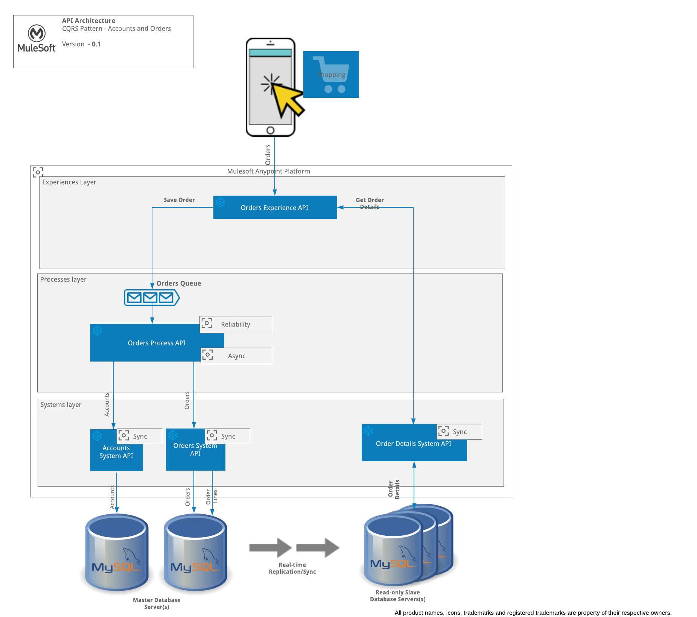

# CQRS Pattern

The Command and Query Responsibility Segregation (CQRS) pattern separates read and write operations for a data store. Implementing CQRS in your application can maximize its performance, scalability, and security.

### How?

* Commands should be task based, rather than data centric. ("Place Order").

* Commands may be placed on a queue for asynchronous processing, rather than being processed synchronously.

* Queries never modify the database. A query returns a DTO that does not encapsulate any domain knowledge.

* For greater isolation, the data-stores are physically separate the read data from the write data.

* The data-sync between write and read database is done using master-slave replication on mysql, however the same can be achieved using ETL tools or Mule Batch programs as well.

**A note of caution**:

* This pattern is not suitable if :-

  * The domain or the business rules are simple.

  * A simple CRUD-style operations are sufficient.

### Usecase

* An ecommerce site or Mobile App which allows to place order and query order details.

* The write model of the order not not just the order header and order lines but also customer related information to be created, and this is based on Task UI

* The read model of the order is based on complex queries.

* The number of reads are very high compared to writes.

* Eventual consistency of data is acceptable

* The following usecase is implemented using Mule as follows:-

  

##### Dependencies

To run this example, you will need :-
* Mule(On-premise)
* AnypoinMQ
* MYSQL RDS with Read-replication enabled

### Setups

* Setup the orders-queue in AnypointMQ

* Run the table creation scripts under docs/scripts folder to create the underlying tables (customer, order_header, order_lines). You can use SQLWorkbench tool to connect to MYSQL database and execute the script.

### Contribution

PK Reddy

### References

https://docs.microsoft.com/en-us/azure/architecture/patterns/cqrs

https://martinfowler.com/bliki/CQRS.html

### Todos

None

### License

UNLICENSED
